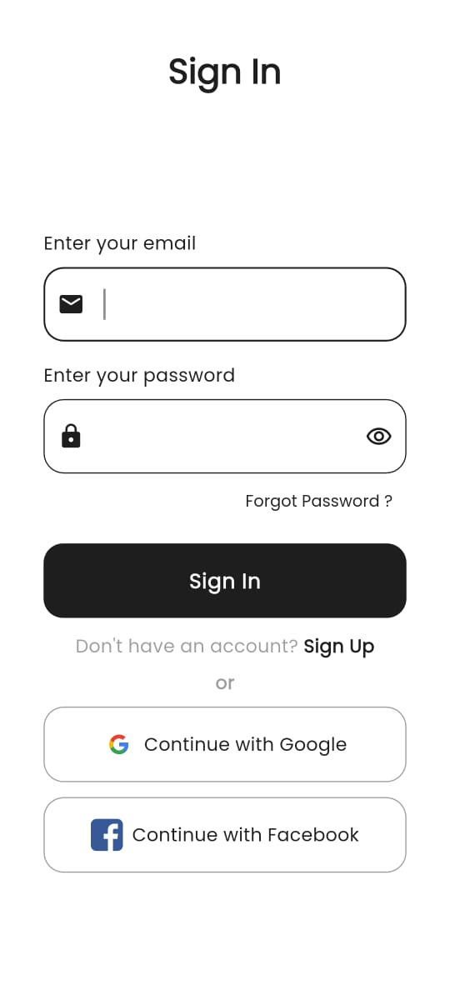
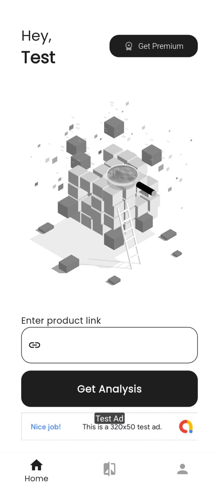
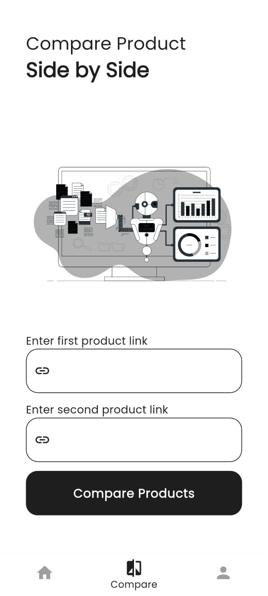
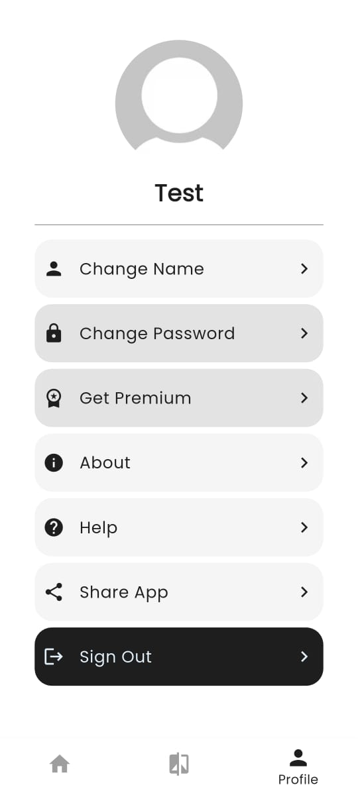
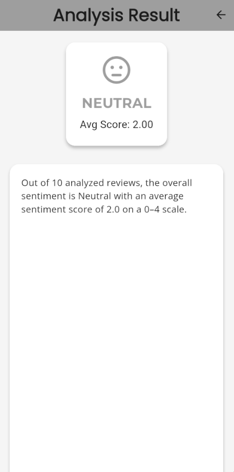
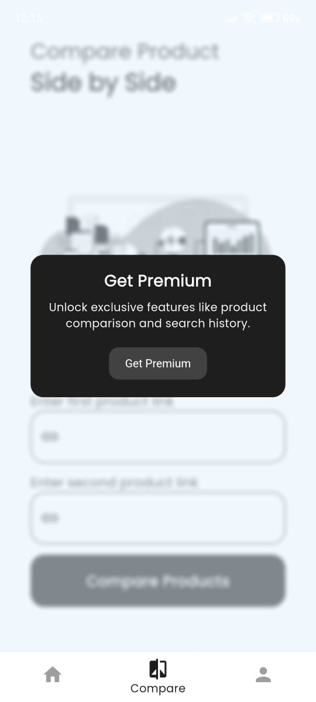

# Sentilytics

Sentilytics is an AI-powered, full-stack application designed to extract and analyze Amazon product reviews. It provides users with deep insights into customer opinions, helping them identify trends, positives, and negatives of a product to make smarter purchasing decisions.

Built with Flutter for the frontend and Spring Boot for the backend, it's a complete solution for buyers, sellers, and researchers looking to analyze real consumer feedback effortlessly.

---

## Screenshots

| Sign In / Auth | Home & Analysis | Comparison (Premium) |
| :---: | :---: | :---: |
|  |  |  |
| **Profile** | **Result Screen** | **Dark Mode** |
|  |  |  |

---

## Features

* **Product Sentiment Analysis**: Get an overall sentiment (Positive, Negative, or Neutral), an average score, and an AI-generated summary for any Amazon product link.
* **Side-by-Side Comparison**: A premium feature allowing users to compare the sentiment analysis of two different products directly.
* **Full User Authentication**: Secure Sign In and Sign Up using Firebase Authentication.
* **Social Sign-In**: Support for one-tap sign-in with Google.
* **Premium Tier**: Unlock features like product comparison and search history by upgrading to a premium account.
* **Payment Integration**: Built-in payment flow using **Razorpay** to handle premium upgrades.
* **Profile Management**: Users can manage their account by changing their display name and password.
* **Dynamic Theming**: Automatically adapts to system settings with full support for both Light and Dark modes.
* **Ad Monetization**: Integrates Google Mobile Ads (Banner Ads) on the home screen for non-premium users.

---

## Technology Stack

This project is a full-stack application separated into a mobile frontend and a RESTful backend.

### **Frontend (Flutter)**

* **Framework**: Flutter
* **Language**: Dart
* **State Management**: Provider
* **Routing**: `go_router`
* **Authentication**: Firebase Authentication
* **Database**: Cloud Firestore (for user data)
* **Payments**: `razorpay_flutter`
* **Ads**: `google_mobile_ads`
* **UI/Utils**: `google_fonts`, `lottie`, `flutter_animate`, `share_plus`

### **Backend (Spring Boot)**

* **Framework**: Spring Boot
* **Language**: Java
* **Sentiment Analysis**: Stanford CoreNLP
* **External API**: RapidAPI (for scraping Amazon reviews)
* **API Client**: `RestTemplate`
* **Utils**: Lombok

---

## Getting Started

To run this project locally, you will need to set up both the backend and frontend services.

### **Prerequisites**

* Flutter SDK
* Java 17 (or newer) & Maven
* Firebase Account (for Auth & Firestore)
* RapidAPI Account (for Amazon review data)
* Razorpay Account (for payments)

### **1. Backend (Spring Boot) Setup**

1.  Navigate to the backend directory (`sentilytics_backend`).
2.  Create an `application.properties` file in `src/main/resources/`.
3.  Add your RapidAPI configuration keys. The service expects two properties:
    ```properties
    # The URL from RapidAPI for Amazon product reviews
    reviews.url.link=[https://real-time-amazon-data.p.rapidapi.com/product-reviews?asin=%s&country=IN&sort_by=RECENT&verified_purchases_only=false&images_or_videos_only=false&current_format_only=false&star_rating=ALL&page=1](https://real-time-amazon-data.p.rapidapi.com/product-reviews?asin=%s&country=IN&sort_by=RECENT&verified_purchases_only=false&images_or_videos_only=false&current_format_only=false&star_rating=ALL&page=1)
    
    # Your personal API key from RapidAPI
    reviews.url.key=YOUR_RAPIDAPI_KEY
    ```
4.  Run the application:
    ```bash
    ./mvnw spring-boot:run
    ```
    The server will start on `http://localhost:8080`.

### **2. Frontend (Flutter) Setup**

1.  Navigate to the Flutter project directory.
2.  **Firebase Configuration**: Set up a new Firebase project and add your `firebase_options.dart` file to the `lib/` directory. Ensure you enable **Email/Password** and **Google** sign-in methods in the Firebase Authentication console.
3.  **Backend URL Configuration**: Open `lib/service/analysis_service.dart` and change the `backendBaseUrl` to point to your running backend:
    ```dart
    // Update this URL to match your backend's address
    final String backendBaseUrl = "[http://10.0.2.2:8080/api/sentilytics](http://10.0.2.2:8080/api/sentilytics)"; // (10.0.2.2 is for Android Emulator)
    // Use http://localhost:8080 for iOS Simulator or web
    ```
4.  **Razorpay Configuration**: Open `lib/widget/get_premium_card.dart` and `lib/widget/get_premium_button.dart`. Update the `'key'` field with your own Razorpay Test Key ID.
5.  Install dependencies:
    ```bash
    flutter pub get
    ```
6.  Run the app:
    ```bash
    flutter run
    ```

---
